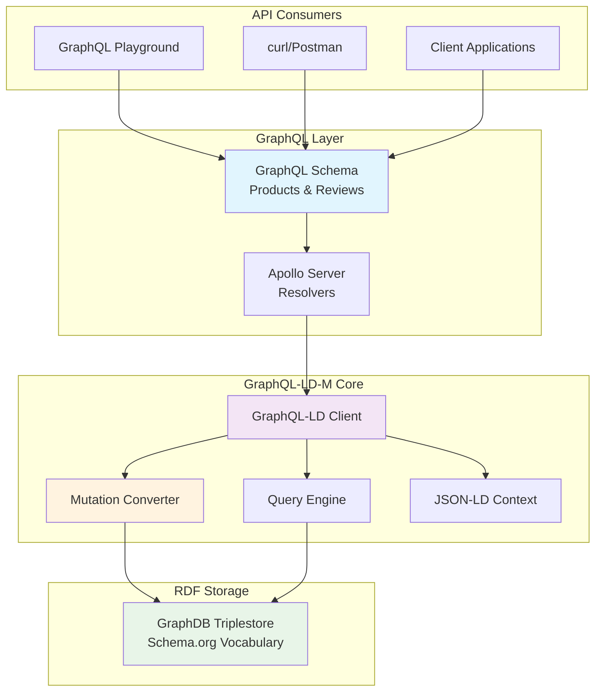
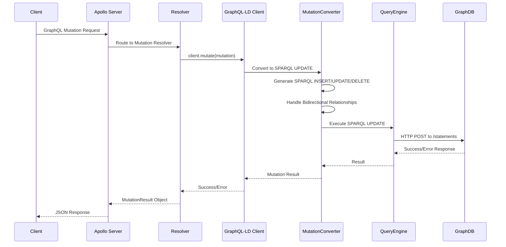
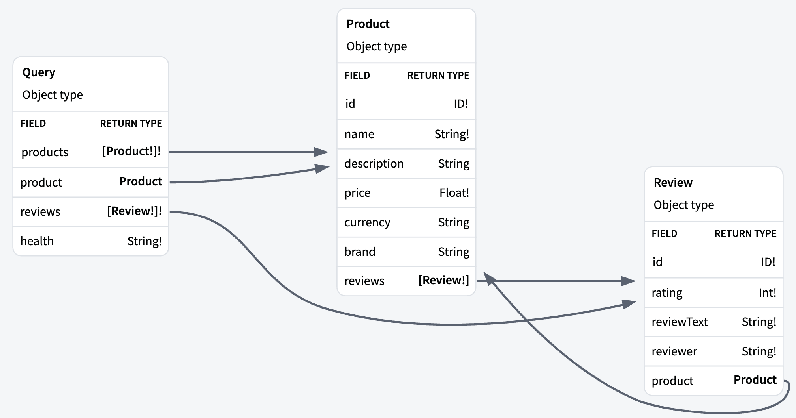

# GraphQL-LD with Mutations (GraphQL-LD-M)

A research implementation extending GraphQL-LD with mutation capabilities for Knowledge Graphs. This project demonstrates bidirectional transformation between GraphQL operations and SPARQL updates, featuring a complete Apollo Server demo with Product-Review relationship modeling.

## 🚀 Quick Start - Apollo Server Demo

### Prerequisites

- **Node.js** (v16 or higher)
- **Docker & Docker Compose** (for GraphDB)
- **Git**

### 1. Setup GraphDB Triplestore

```bash
# Clone the repository
git clone <your-repo-url>
cd graphql-ld-m

# Start GraphDB with Docker Compose
docker-compose up -d

# Verify GraphDB is running
curl http://localhost:7200/rest/repositories
```

GraphDB will be available at:
- **Web Interface**: http://localhost:7200
- **Repository**: `graphql-demo`
- **Query Endpoint**: http://localhost:7200/repositories/graphql-demo
- **Update Endpoint**: http://localhost:7200/repositories/graphql-demo/statements

### 2. Install Dependencies

```bash
npm install
```

### 3. Start Apollo Server

```bash
npx ts-node examples/graphql-server.ts
```

The server will start at **http://localhost:4000** with example queries displayed in the console.

### 4. Test the Demo

#### Option A: Using curl (Command Line)

```bash
# Create a product
curl -X POST http://localhost:4000/ \
  -H "Content-Type: application/json" \
  -d '{"query":"mutation { createProduct(input: { name: \"MacBook Pro\", description: \"Latest MacBook Pro with M3 chip\", price: 2499.99, currency: \"USD\", brand: \"Apple\" }) { success message id } }"}'

# Query all products
curl -X POST http://localhost:4000/ \
  -H "Content-Type: application/json" \
  -d '{"query":"query { products { id name description price currency brand reviews { id rating reviewText reviewer } } }"}'

# Create a review (use the product ID from above)
curl -X POST http://localhost:4000/ \
  -H "Content-Type: application/json" \
  -d '{"query":"mutation { createReview(input: { rating: 5, reviewText: \"Excellent product!\", reviewer: \"john@example.com\", productId: \"product:1234567890\" }) { success message id } }"}'

# Query all reviews with products
curl -X POST http://localhost:4000/ \
  -H "Content-Type: application/json" \
  -d '{"query":"query { reviews { id rating reviewText reviewer product { id name description price currency brand } } }"}'
```

#### Option B: Using GraphQL Playground

1. Open http://localhost:4000 in your browser
2. Use the example queries provided in the console output
3. Experiment with different mutations and queries

#### Option C: Using Insomnia/Postman

- **Endpoint**: http://localhost:4000/
- **Method**: POST
- **Content-Type**: application/json
- **Body**: Use the example queries from the console output

## 🏗️ Architecture Overview

### System Architecture



### Data Model



```mermaid
erDiagram
    %% ───────────────────  ENTITIES  ───────────────────
    PRODUCT {
        string id PK
        string name
        string description
        decimal price
        string currency
        string brand
    }

    REVIEW {
        string id PK
        int rating
        string reviewText
        string reviewer
        string productId FK
    }

    %% ────────────────  RELATIONSHIPS  ────────────────
    %% A product may have zero … many reviews
    PRODUCT ||--o{ REVIEW  : "schema:review"

    %% Each review is for exactly one product
    REVIEW  }o--|| PRODUCT : "schema:itemReviewed"
```

### Mutation Queries Processing Flow



### Core Components

1. **Apollo Server** (`examples/graphql-server.ts`)
   - GraphQL schema definition
   - Resolvers for queries and mutations
   - Integration with GraphQL-LD client

2. **GraphQL-LD Client** (`src/client/Client.ts`)
   - Bridges GraphQL and SPARQL
   - Handles query transformation
   - Manages mutations

3. **Mutation Converter** (`src/mutation/MutationConverter.ts`)
   - Converts GraphQL mutations to SPARQL UPDATE
   - Handles relationship creation
   - Manages bidirectional links

4. **Query Engine** (`src/engine/QueryEngineSparqlEndpoint.ts`)
   - Executes SPARQL queries against GraphDB
   - Handles both SELECT and UPDATE operations

### Data Model

The demo uses Schema.org vocabulary for Product-Review relationships:

```json
{
  "@context": {
    "@base": "http://example.org/",
    "@vocab": "http://example.org/",
    "schema": "https://schema.org/",
    "Product": "schema:Product",
    "Review": "schema:Review",
    "name": "schema:name",
    "description": "schema:description",
    "price": "schema:price",
    "reviews": "schema:review",
    "product": "schema:itemReviewed"
  }
}
```

## 📋 GraphQL Schema

### Complete Schema Definition

```graphql
type Product {
  id: ID!
  name: String!
  description: String
  price: Float!
  currency: String
  brand: String
  reviews: [Review!]
}

type Review {
  id: ID!
  rating: Int!
  reviewText: String!
  reviewer: String!
  product: Product
}

type MutationResult {
  success: Boolean!
  message: String
  id: String
}

input ProductInput {
  id: ID
  name: String!
  description: String
  price: Float!
  currency: String
  brand: String
}

input ProductUpdateInput {
  name: String
  description: String
  price: Float
  currency: String
  brand: String
}

input ReviewInput {
  id: ID
  rating: Int!
  reviewText: String!
  reviewer: String!
  productId: ID
}

type Query {
  # Query all products
  products: [Product!]!
  
  # Query product by ID
  product(id: ID!): Product
  
  # Query all reviews
  reviews: [Review!]!
  
  # Health check
  health: String!
}

type Mutation {
  # Product mutations
  createProduct(input: ProductInput!): MutationResult!
  updateProduct(id: ID!, input: ProductUpdateInput!): MutationResult!
  deleteProduct(id: ID!): MutationResult!
  
  # Review mutations
  createReview(input: ReviewInput!): MutationResult!
  deleteReview(id: ID!): MutationResult!
}
```

### JSON-LD Context Mapping

The GraphQL schema maps to RDF using the following JSON-LD context:

```json
{
  "@context": {
    "@base": "http://example.org/",
    "@vocab": "http://example.org/",
    "schema": "https://schema.org/",
    "xsd": "http://www.w3.org/2001/XMLSchema#",
    
    "Product": "schema:Product",
    "Review": "schema:Review",
    
    "name": "schema:name",
    "description": "schema:description",
    "price": { "@id": "schema:price", "@type": "xsd:decimal" },
    "currency": "schema:priceCurrency",
    "brand": "schema:brand",
    "rating": { "@id": "schema:ratingValue", "@type": "xsd:integer" },
    "reviewText": "schema:reviewBody",
    "reviewer": "schema:author",
    
    "reviews": { 
      "@id": "schema:review", 
      "@type": "@id",
      "@container": "@set"
    },
    "product": { 
      "@id": "schema:itemReviewed", 
      "@type": "@id" 
    }
  }
}
```

### Visual Schema Diagram



*Interactive SVG version available at: [docs/graphql_schema_visualization.svg](docs/graphql_schema_visualization.svg)*

## 📋 API Reference

### Product Operations

#### Create Product
```graphql
mutation {
  createProduct(input: {
    name: "Product Name"
    description: "Product Description"
    price: 99.99
    currency: "USD"
    brand: "Brand Name"
  }) {
    success
    message
    id
  }
}
```

#### Query Products
```graphql
query {
  products {
    id
    name
    description
    price
    currency
    brand
    reviews {
      id
      rating
      reviewText
      reviewer
    }
  }
}
```

#### Update Product
```graphql
mutation {
  updateProduct(id: "product:123", input: {
    price: 89.99
    description: "Updated description"
  }) {
    success
    message
    id
  }
}
```

#### Delete Product
```graphql
mutation {
  deleteProduct(id: "product:123") {
    success
    message
    id
  }
}
```

### Review Operations

#### Create Review
```graphql
mutation {
  createReview(input: {
    rating: 5
    reviewText: "Great product!"
    reviewer: "user@example.com"
    productId: "product:123"
  }) {
    success
    message
    id
  }
}
```

#### Query Reviews
```graphql
query {
  reviews {
    id
    rating
    reviewText
    reviewer
    product {
      id
      name
      description
      price
      currency
      brand
    }
  }
}
```

## 🔧 Configuration

### GraphDB Configuration

The GraphDB repository is configured in `graphdb-init/graphql-demo-config.ttl`:

```turtle
@prefix rep: <http://www.openrdf.org/config/repository#> .
@prefix sr: <http://www.openrdf.org/config/repository/sail#> .
@prefix sail: <http://www.openrdf.org/config/sail#> .
@prefix owlim: <http://www.ontotext.com/trree/owlim#> .

[] a rep:Repository ;
   rep:repositoryID "graphql-demo" ;
   rdfs:label "GraphQL Demo Repository" ;
   rep:repositoryImpl [
      rep:repositoryType "graphdb:FreeSailRepository" ;
      sr:sailImpl [
         sail:sailType "graphdb:FreeSail" ;
         owlim:base-URL "http://example.org/" ;
         owlim:defaultNS "" ;
         owlim:entity-index-size "10000000" ;
         owlim:entity-id-size "32" ;
         owlim:imports "" ;
         owlim:repository-type "file-repository" ;
         owlim:ruleset "rdfs-plus" ;
         owlim:storage-folder "storage" ;
         owlim:enable-context-index "false" ;
         owlim:enablePredicateList "true" ;
         owlim:in-memory-literal-properties "true" ;
         owlim:enable-literal-index "true" ;
         owlim:check-for-inconsistencies "false" ;
         owlim:disable-sameAs "true" ;
         owlim:query-timeout "0" ;
         owlim:query-limit-results "0" ;
         owlim:throw-QueryEvaluationException-on-timeout "false" ;
         owlim:read-only "false" ;
      ]
   ] .
```

### Apollo Server Configuration

Key configuration in `examples/graphql-server.ts`:

```typescript
// GraphQL-LD Client Configuration
const client = new Client({ 
  context, 
  queryEngine: new QueryEngineSparqlEndpoint(
    'http://localhost:7200/repositories/graphql-demo',      // Query endpoint
    'http://localhost:7200/repositories/graphql-demo/statements'  // Update endpoint
  ) 
});

// Apollo Server Configuration
const server = new ApolloServer({
  typeDefs,
  resolvers,
  introspection: true,
  playground: true
});
```

## 🧪 Testing

### Run Unit Tests
```bash
npm test
```

### Run Integration Tests
```bash
# Ensure GraphDB is running
docker-compose up -d

# Run mutation demo
npx ts-node examples/mutation-demo.ts
```

### Manual Testing with SPARQL

You can verify data directly in GraphDB:

1. Open http://localhost:7200
2. Select `graphql-demo` repository
3. Run SPARQL queries:

```sparql
# Query all products
SELECT ?product ?name ?price WHERE {
  ?product a <https://schema.org/Product> ;
           <https://schema.org/name> ?name ;
           <https://schema.org/price> ?price .
}

# Query all reviews with products
SELECT ?review ?rating ?text ?product ?productName WHERE {
  ?review a <https://schema.org/Review> ;
          <https://schema.org/ratingValue> ?rating ;
          <https://schema.org/reviewBody> ?text ;
          <https://schema.org/itemReviewed> ?product .
  ?product <https://schema.org/name> ?productName .
}
```

## 🚨 Troubleshooting

### GraphDB Issues

```bash
# Check if GraphDB is running
docker ps | grep graphdb

# Check GraphDB logs
docker logs graphdb-graphql-demo

# Restart GraphDB
docker-compose down && docker-compose up -d

# Verify repository exists
curl http://localhost:7200/rest/repositories
```

### Apollo Server Issues

```bash
# Check if port 4000 is available
lsof -i :4000

# Restart Apollo Server
pkill -f "ts-node examples/graphql-server.ts"
npx ts-node examples/graphql-server.ts
```

### Common Issues

1. **"Repository not found"**: Ensure GraphDB is running and repository is created
2. **"Connection refused"**: Check if GraphDB is accessible at localhost:7200
3. **"Mutation failed"**: Verify the input data format and required fields
4. **"Query timeout"**: Check GraphDB performance and query complexity

## 📚 GraphDB-Apollo Server Demo

This implementation demonstrates:

1. **GraphQL-LD Extension**: Adding mutation capabilities to GraphQL-LD
2. **Semantic Preservation**: Maintaining RDF semantics through mutations
3. **Bidirectional Relationships**: Automatic creation of inverse relationships
4. **Type Safety**: Full TypeScript implementation with proper typing
5. **Performance**: Optimized query execution and caching

## 📄 License

MIT License - see [LICENSE](LICENSE) file for details.